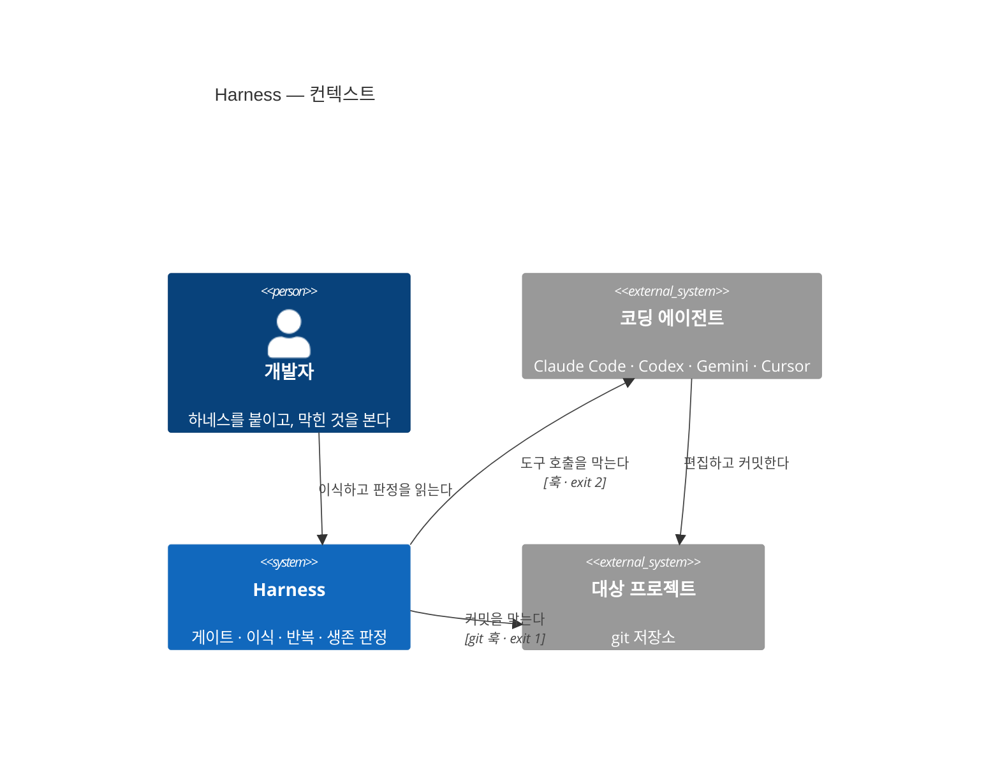
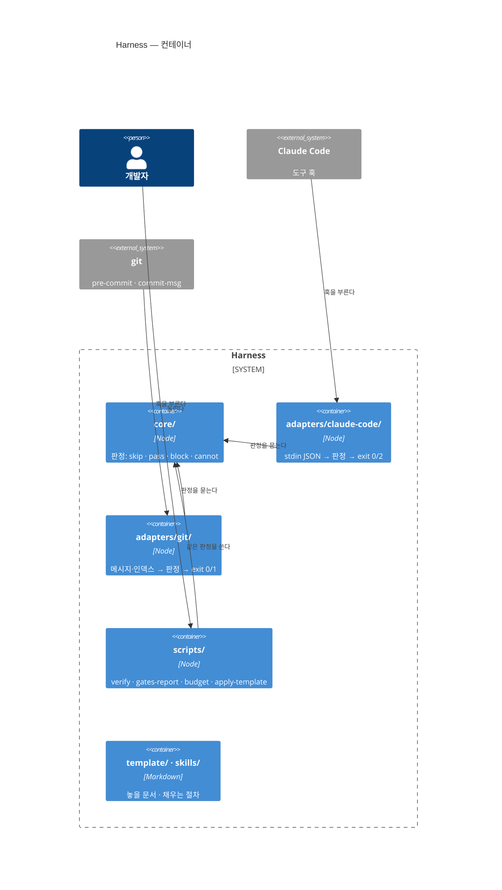

> **답하는 질문:** 무엇이 어디 있고 무엇이 무엇과 이어지나 — 지금 구조
> **읽을 때:** 모듈·경계를 건드릴 때 · 새 컨테이너를 만들 때
> **바뀔 때:** 구조가 바뀌면. 신선도는 게이트가 아니라 **회고가** 지킨다

# Harness — 아키텍처

## 기준

이 구조는 `PRD.md` 의 품질 목표 **Q1**(판정 실패가 통과로 접히지 않는다)과
**Q3**(에이전트에 묶이지 않는다)를 기준으로 나눴다. 판정을 한 곳(`core/`)에 모으고,
에이전트마다 다른 입출력 규약은 어댑터가 맡는다.

## L1 — 시스템 컨텍스트

## L2 — 컨테이너

| 컨테이너 | 정한 결정 |
|---|---|
| `core/` · 두 어댑터 | 없음 — 결정 로그가 생기기 전에 정했다. 근거는 `README.md`·`core/verdict.mjs` |
| `adapters/claude-code/guard-script-writes` | `D6` |
| `adapters/claude-code/stop-check` · `session-baseline` · `scripts/done` | `D11` · 복구점 `D16` |
| `core/blocklog` (두 어댑터가 막을 때 남긴다) | `D14` |
| `core/off` (`guard` 가 먼저 본다) | `D15` |
| `template/.claude/settings.project.json` · `rules/cycle.md` | `D13` · `D12` |
| `scripts/apply-template` · `skills/` | `D4` · `D5` |

## 데이터

DB 없음. 상태는 설정 셋이다 — `.claude/harness-budgets.json`(예산),
`.claude/harness-gates.json`(`stack:none` 선언), `~/.claude/settings.json`(훅 등록).
그리고 대상 저장소의 `<git-dir>/harness/` — 세션 기준점과 판정 기록. 커밋되지 않는다(`D11`).
